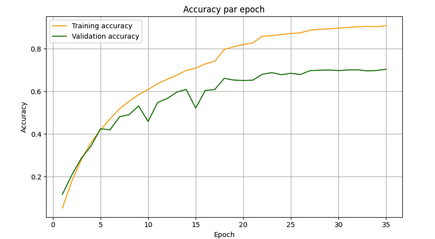
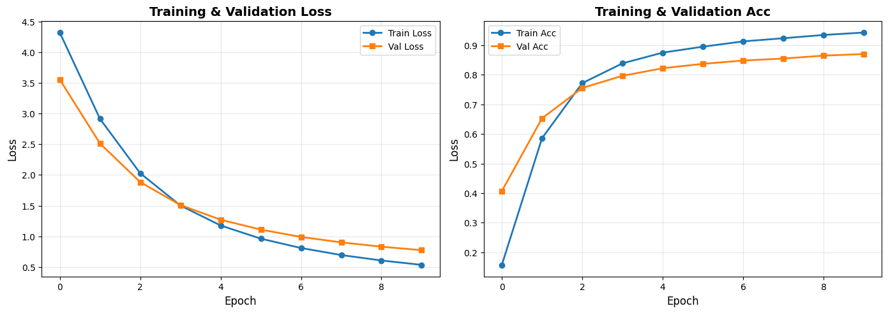

# pokemon_nn_on_steroids

## Description 
Ce projet est plutot court, il reprend des éléments du projet pokemon_nn qui avait été réalisé dans un cadre scolaire et le pousse a un niveau plus professionnel.  
Il s'agissait d'un projet de computer vision qui entrainait un classifieur a reconnaitre les pokemons de la première génération.  
Cependant il s'agissait uniquement d'un projet académique, tout reposait dans un notebook ce qui est très bien pour de l'explo ou du scolaire mais niveau mise en prod ...  
Donc j'en ai profité pour le refondre totalement en en proposant une version "sous stéroides".  
Le premier projet était un réseau de neuronne convolutif (CNN) très léger qui pouvait tourner en local et donc on a pensé l'architecture afin qu'elle soit légère.  
Cette fois il s'agit de ce qui se fait de mieux actuellement en termes de computer vision un VIT (Vision Transformer).  
Encore une fois j'ai adopté la stratégie du transfer learning afin d'avoir d'excellents résultats en capitalisant sur l'entrainement d'autrui.  
Pour résumer : ***on prend le squelette de pokemon_nn et on l'habille chez Gucci***

## Démonstration
Petite démonstration du modèle sur des images du test set.  

<p align="center">
  <a href="https://youtu.be/7ZLl6D2uANc">
    
  </a>
</p>

## Principales différences avec pokemon_nn v1 

### Frameworks 
La premiere version de ce projet était en Keras (built au dessus de Tensorflow).  
Btw j'ai découvert récemment qu'on peut set le backend de Keras pour pytorch.  
Cette version améliorée et production-ready du projet [pokemon_nn](https://github.com/gaabsi/pokemon_nn/tree/main) est en pytorch_lightning (built au dessus de Pytorch qui permet d'être bcp moins verbeux et de garder une structure qui varie peu (top pour debug)).  

### Modèles
Pour le premier projet, on s'était fixé comme contrainte l'efficience, on voulait un projet plutot léger qui puisse être entrainé sur un laptop et le challenge c'était donc d'en faire un dont l'architecture compensait (en partie) les faibles ressources machines qu'on pouvait lui allouer.  
On a réussi ce premier challenge en utilisant un CNN.  
Mais avec plus de puissance de calcul sous le coude (merci les VM distantes) il devient possible de faire un modèle vraiment super performants en partant des mêmes données.  
Donc pour cette version sous stéroîdes plus de contraintes machines je voulais juste un modele qui prend les mêmes images d'entrainement et voir ce que ca fait aux performances.  
En classification d'image ce qui se fait de mieux c'est les ViT, je suis parti sur un ViT particulier qui apprend particulierement bien des petits datasets DeiT, une version développée par facebook et j'ai lancé un entrainement rapide en dé-freezant la tête de classification et en l'appliquant à ma tâche de classification.  

### Pré-processing 
C'est le seul point qui diverge un peu des deux méthodologies, dans la version originale de pokemon_nn, pour avoir un modèle super léger on l'avait fait tourner sur des toutes petites images (64x64) là les images sont toujours relativement petites, mais comparativement elles sont beaucoup plus grosses car on donne a manger à notre DeiT des images de taille (224x224).  
Donc j'avais 2 choix sur les images qui étaient plus petites que (224x224) : 
- les supprimer : dommage on perd de la donnée
- les augmenter : on peut avoir des images un peu farfelues et si en plus on les augmente on peut créer des monstres
J'aurais aussi pu 0 padder autour mais c'est pas l'idéal. 

Donc j'ai choisi l'option de les supprimer et on a donc un peu moins de data que dans la premiere version du projet.  
Ensuite on fait la pipeline classique : 
- split en train test et val 
- augmentation sur le train set pour rééquilibrer les classes 
- ***Dans cet ordre là pour éviter le leakage*** 
- ... training ... 
- ... evaluation ... 

### Performances 
Comparons rapidement les performances de nos 2 modèles.  


Ce premier modele (version CNN léger Tensorflow) on avait tout fait pour le limiter mais on avait quand meme un petit overfit de notre modèle.  
Le modèle n'étais pas mauvais mais n'excellait pas non plus on avait une val_acc autour des 0.7 ce qui encore une fois est plutot pas mauvais compte tenu des limites qu'on s'était fixé (légèreté de l'entrainement du modèle + nombre de classes, ...).  
***On avait une accuracy sur le jeu de test de 71.21%.  ***
Passons maintenant à la star du show, voici les performances du deuxieme modèle.  



Ici on est sur le Data efficient image Transformer (DeiT) et on voit qu'on a des performances bien plus élevées.  
On a toujours un petit overfit mais qui est bien plus réduit que sur le premier modèle.  
Les performances sont nettement supérieures à celles de notre CNN léger (ça s'explique par la meilleure qualité des images mais aussi car on compare une bombe atomique à un bébé qui tousse en terme de nombre de paramètres et de complexité).  
J'aurais pu avoir des performances encore un peu meilleures en dé-freezant plus que la tête de classification mais honnêtement les performances étaient déjà tellement bonnes que je me suis arrêté là.  
***En utilisant notre nouveau modèle pour prédire les labels de notre test set on a une accuracy de 91.77%.  ***


Les deux moèles ont leurs avantages et leurs inconvénients (majoritairement au niveau de la puissance de calcul nécessaire pour l'entrainement) mais en termes de performances le second l'emporte haut la main.  

## Structure du projet 
```
pokemon_nn_on_steroids/ 
    ├── README.md 
    ├── src/                            # Codes du projet
    │   ├── get_images.py               # Script qui prend le dataset zipé que j'ai stocké sur mon Huggingface
    │   ├── data_prep.py                # Script de data préparation 
    │   ├── modele.py                   # Modelisation et entrainement
    │   ├── evaluation.py               # Evaluation des performances du modele
    │   └── app.py                      # Streamlit ultra basique pour me la peter dans le README
    ├── models/                         # Stockage des modeles entrainés
    │   ├── old/                        # Ancienne version du modele (CNN)
    │   │   ├── old_eval_modele.png     # Ancien schéma pour monitorer l'over/under fit du modele
    │   │   └── pokedex_64x64.keras     # Poids du modèle (CNN) de la v1 du projet 
    │   └── version_0/                  # Premiere (et unique) version du nouveau modele
    │       ├── version_0.ckpt          # Poids de notre premier modele (pas push mais sur Hugging Face Hub on le récupère juste après)
    │       └── lightning_logs/         # Logs de l'entrainement du modele
    │           ├── eval_modele.png     # Schémas pour monitorer l'eventuel l'over/under fit du modele
    │           ├── metrics.csv         # Logs générés par lightning
    │           └── test_perf.csv       # Prédictions détaillées (chaque pred sur le test set, sa proba, son true label, ...)
    ├── data/                           # Data dir (non push) 
    │   ├── raw_data/                   # Dataset unzipé qui sort tout fraichement de mon Huggingface
    │   └──  split_data/                 # Dir qui contient les train, val et test data splités proprement 
    │       ├── train/                  # Images utilisées pour le training
    │       ├── val/                    # Images utilisées pour la validation
    │       └── test/                   # Images utilisées pour le test
    ├── Dockerfile                      # Dockerfile du projet
    ├── main.sh                         # Pour lancer tout le projet sans se casser la tete (entrainement gourmand, déconseillé en local, préferer une VM)
    ├── .gitignore                      # Fichiers a ignorer par Git 
    └── requirements.txt                # Packages du projet


```

## Clonage du projet 
Pour reprendre le projet, l'idéal c'est de pas refaire tourner tout l'entrainement et de récupérer uniquement les poids pour load le modele.  
Moi pour l'entrainement je n'ai pas voulu faire bruler mon pc j'ai donc fait tourner ca dans un pod de runpod, sur docker_hub sous le même nom que ce projet et tag :latest il y a l'image que j'avais utilisé pour explorer un peu l'entrainement du modèle.  

Pour réutiliser le projet : 
```bash 
cd ~
git clone https://github.com/gaabsi/pokemon_nn_on_steroids.git
```

On récupère les poids que j'ai stocké sur Huggingface (le dataset aussi si on regarde bien les codes lol) : 
```bash 
cd ~/pokemon_nn_on_steroids
huggingface-cli download gaabsi/pokemon_nn_on_steroids version_0.ckpt --local-dir ./models/version_0
rm -rf ./models/version_0/.cache/
```

On crée l'image Docker et on run :
```bash 
cd ~/pokemon_nn_on_steroids
docker buildx build --platform linux/amd64,linux/arm64 -t pokemon_nn_on_steroids:latest . 
docker run --rm -v ~/pokemon_nn_on_steroids:/app pokemon_nn_on_steroids:latest 
```

Par défaut dans le main qui est exécuté j'ai commenté la ligne d'entrainement et comme on a importé les poids depuis Huggingface ça fonctionne mais c'est possible de la décommenter si vous avez le GPU adapté.  

